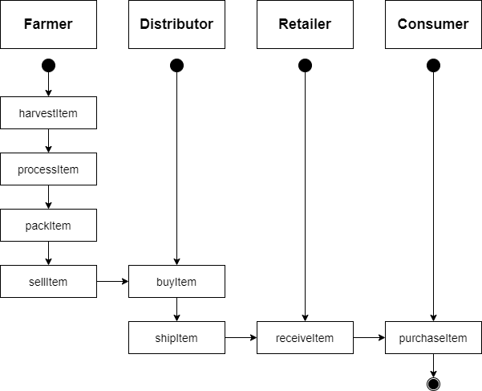
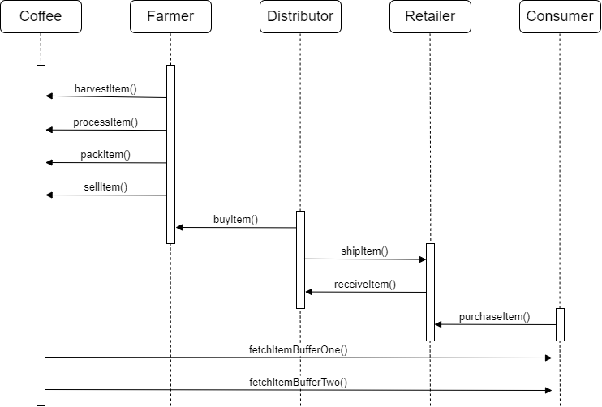
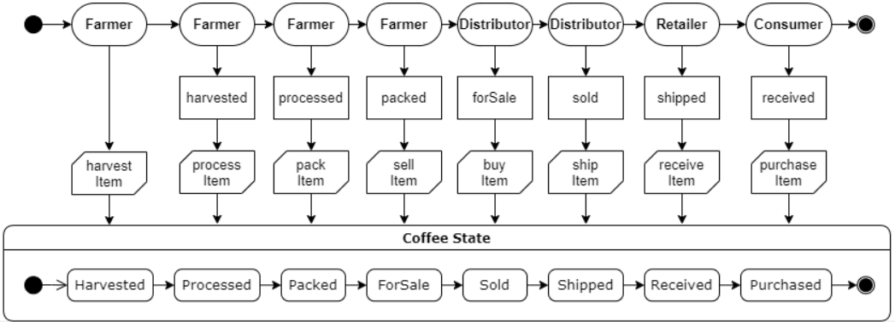
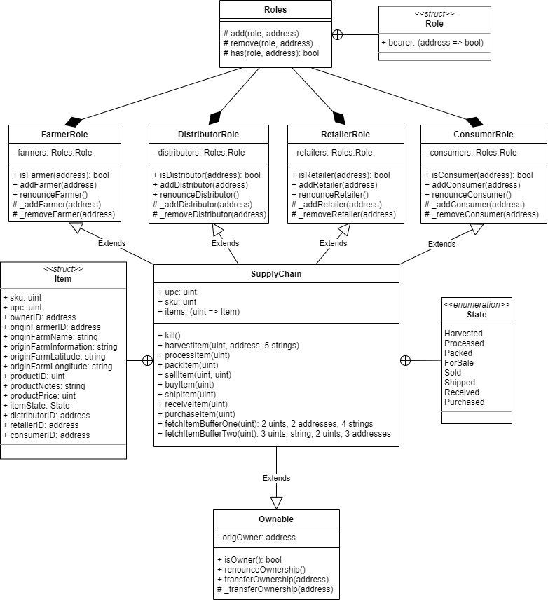

# Blockchain Supply Chain Dapp

This repository containts an Ethereum DApp that demonstrates a Supply Chain flow between a Seller and Buyer. The user story is similar to any commonly used supply chain process. A Seller can add items to the inventory system stored in the blockchain. A Buyer can purchase such items from the inventory system. Additionally a Seller can mark an item as Shipped, and similarly a Buyer can mark an item as Received.

## Getting Started

The following versions were used for this project: (IPFS no used)

```
Truffle v5.1.0 (core: 5.1.0) --> Development framework for Ethereum(make life easier)         
Solidity - 0.5.0 (solc-js) ----> Smart contract programming language      
Node v10.7.0 ------------------> Help with backend for this Dapp
Web3.js v1.2.2 ----------------> Allow to interact with a local/remote ethereum node
hdwallet-provider v1.2.6 ------> Useful to deploy the smart contract on RINKEBY test network
Ganache CLI :: v6.12.2 --------> Create a personal Ethereum blockchain(for dev, tests, etc)
```

After cloning the repository, change directory to ```project-6``` folder and install all requisite npm packages (as listed in ```package.json```):

```
cd project-6
npm install
```

Launch Ganache(the chainId used here was 1337):

```
ganache-cli --deterministic -i 1337 --chainId 1337 "spirit supply whale amount human item harsh scare congress discover talent hamster"
```

Then, in a separate terminal window, you can ```compile, migrate and test``` the smart contracts.

## UML Diagrams

For this project, we have the following UML diagrams:


### Activity Diagram



### Sequence Diagram



### State Diagram



### Classes Diagram



## Transaction ID / Contract Address in Rinkeby
For SupplyChain contract we have:

- Transaction ID: 0xddd216385469e0c998a1075ab9f459ecfdfc31b3820cbd455b400cafd328414f
- Contract address: 0x247f32Ca94D1530dEc6f0e090143A882fb15D1b2

You can check in etherscan with the link: https://rinkeby.etherscan.io/address/0x247f32Ca94D1530dEc6f0e090143A882fb15D1b2
